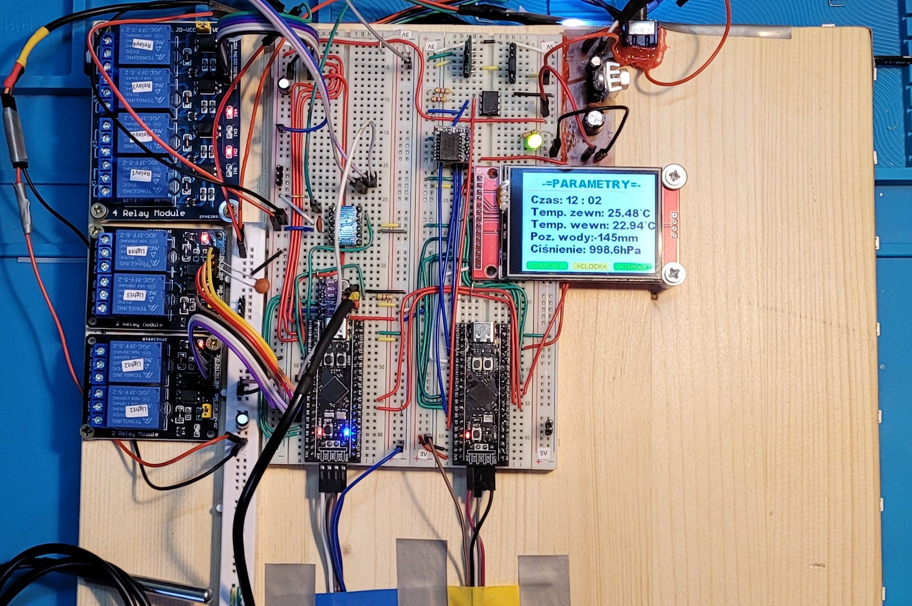

# Aquarium controller
>The project, with the working name "free_miechelle", is a response to the lack of market proposals for aquarium control and management devices.

>>Now this project is being developed in another repository. -> https://github.com/grados73/akwa_elektron

## Table of contents
* [General info](#general-info)
* [Screenshots](#screenshots)
* [Technologies](#technologies)
* [HARDWARE](#hardware)
* [Features](#features)
* [Status](#status)
* [Inspiration](#inspiration)
* [Contact](#contact)

## General info
Aquarium hobby has been one of my hobbies for over 10 years, along with cars, sports and electronics. I am a bit of a gadgeteer and like to have everything possible in a smart version, with easy management and monitoring. The same goes for aquariums, I would like to enjoy all the benefits that come with this hobby. Yes, I am a bit lazy. I would like to put in as little effort as possible, while being sure that my fish are well taken care of, even when I am away from home.  But there are no satisfactory solutions on the market to buy and use. All the devices that already exist have either limited capabilities or a technological debt that is heavily visible. Therefore, I decided to make such a device myself. I am currently at the stage of the first prototype, which I assemble using prototype boards. 

## Screenshots
Currently, the device is in a prototype version. It has been assembled on two prototype boards. The next version will have a dedicated PCB.

Short wideo:
https://youtu.be/HiZ6xpy-laI

Currently, the software allows you to control the device and communicate with it through a 2.4" TFT screen, controlled by SPI. All commands are issued via the touch screen available on each of the 8 menu screens. 

## Technologies
Project is created with:
* C,
* HAL for STM32F4,
*
* STM32CubeIDE,
* The Dot Factory v.0.1.4,
* InkScape v.0.92.4,
* Image2Lcd v3.2

## HARDWARE
* 2x Blackpill STM32F411CEU6 
* TFT LCD 2,4″ (240x320px) with ILI9341 controller - SPI
* RTC DS3231 - I2C
* EEPROM memory 1kb - I2C
* BMP280 - I2C
* DS18B20 - 1-WIRE
* Ultrasonic distance sensor - DFRobot SEN0311 - UART
* WS2812b - I2C

## Features
* Menu on TFT Display - DONE
* Touch Interface - DONE
* Relay Control - DONE
* WS2812b LEDs Control  - DONE
* Predefined Activities like feeding or cleaning - DONE
* Display Pressure and Temperature inside and outside the aquarium  - DONE
* Display current day of week, hour and minute and possibility to change them in RTC - DONE
* Measuring the water level in the aquarium - DONE

## To-do list
* Shedules - TODO
* Alarms - TODO
* PCB - TODO
* Watchdog - TODO
* UPS - TODO
* Online access(ESP) - TODO
* Wireless comunitation with sensors - nRF24L01+ - TODO
* Push inormation on telephone - TODO

## Status
Project is in progress and i will develop them to learn ARM and STM32.

## Inspiration
It will be added.

## Contact
Created by https://www.linkedin.com/in/kamil-gradowski-8706991aa - feel free to contact me!
grados73
